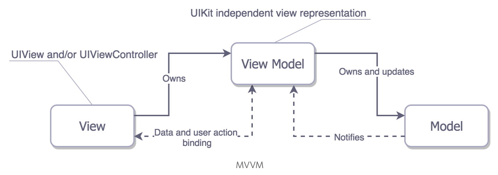

# MVC, MVVM, MVP 디자인 패턴과 디자인 패턴의 필요성

## 개요

`MVC`, `MVP`, `MVVM` 패턴은 Application의 행동을 세 가지의 역할로 나누어 레이어를 부여한 디자인 패턴이다. 각 패턴들은 이름에서도 알 수 있듯이 MV(…)로 시작되며, 여기서 `M`, `V`, `C / P / VM`는 각각 `Model(M)`, `View(V)`, `Controller(C) / Presenter(P) / ViewModel(VM)`을 뜻한다. 각각은 다음과 같은 역할을 수행한다.

* `Model` : Data 접근을 위한 Layer 혹은 데이터 자체를 책임지는 영역
* `View` : 레이어에 표현되는 것을 책임지는 영역. 말 그대로 View와 관련된 영역.
* `Controller` / `Presenter` / `ViewModel` : View를 업데이트하는 책임과 Model을 변경하는 책임을 가지며 경우에 따라 Activity의 역할을 수행하기도 한다. 

## MVC

### 전통적인 MVC

사실 MVC 패턴 조사 과정에서 애플에서 설명하는 MVC가 전통적인 MVC와는 차이가 있다는 사실을 깨달았다. 그래서 둘의 차이를 알아보는 것이 먼저라고 생각되어 전통적인 MVC에 대해서 조사하였다. 아래 그림은, 전통적인 MVC를 설명하는 그림이다.

전통적인 MVC에서는 User가 View를 통해 유저 액션을 Controller에게 전달하고, CController는 Model에게 업데이트 요청을 보낸다. Model의 변경이 완료되면, Model은 View에게 변경 사항을 알리고 View는 이 내용을 바탕으로 Update된다.

### Apple's MVC

## MVP

## MVVM

## 디자인 패턴의 필요성

#### 출처

[Apple Developer MVC 문서](https://developer.apple.com/library/content/documentation/General/Conceptual/DevPedia-CocoaCore/MVC.html)
