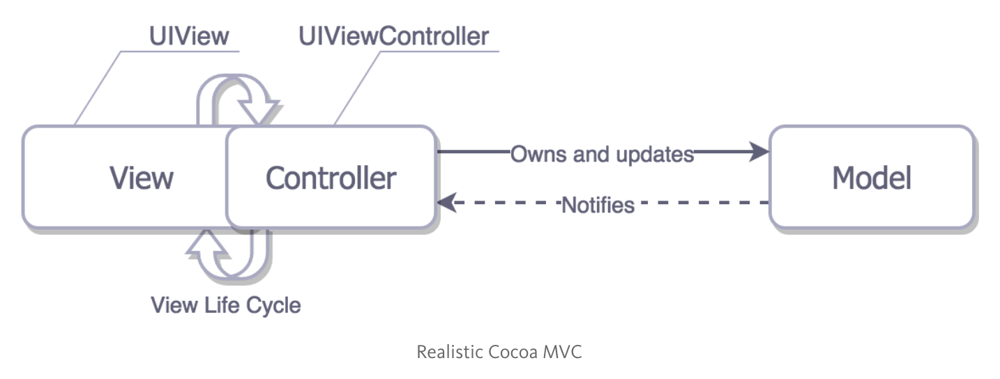
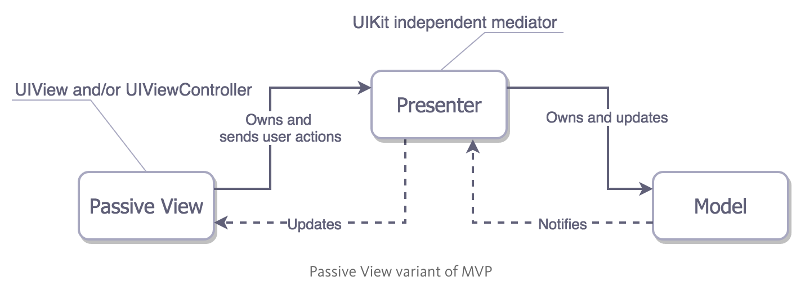

# MVC, MVVM, MVP 디자인 패턴과 디자인 패턴의 필요성

## 개요

`MVC`, `MVP`, `MVVM` 패턴은 Application의 행동을 세 가지의 역할로 나누어 레이어를 부여한 디자인 패턴이다. 각 패턴들은 이름에서도 알 수 있듯이 MV(…)로 시작되며, 여기서 `M`, `V`, `C / P / VM`는 각각 `Model(M)`, `View(V)`, `Controller(C) / Presenter(P) / ViewModel(VM)`을 뜻한다. 각각은 다음과 같은 역할을 수행한다.

* `Model` : Data 접근을 위한 Layer 혹은 데이터 자체를 책임지는 영역
* `View` : 레이어에 표현되는 것을 책임지는 영역. 말 그대로 View와 관련된 영역.
* `Controller` / `Presenter` / `ViewModel` : View를 업데이트하는 책임과 Model을 변경하는 책임을 가지며 경우에 따라 Activity의 역할을 수행하기도 한다. 

## MVC

### 전통적인 MVC

사실 MVC 패턴 조사 과정에서 애플에서 말하는 MVC가 전통적인 MVC와는 차이가 있다는 사실을 알게 되었다. 그래서 둘의 차이를 알아보는 것이 필요하다고 생각했다. 아래 그림은, 전통적인 MVC를 설명하는 그림이다.

전통적인 MVC에서는 User가 View를 통해 유저 액션을 Controller에게 전달하고, Controller는 Model에게 업데이트 요청을 보낸다. Model의 변경이 완료되면, Model은 View에게 변경 사항을 알리고 View는 이 내용을 바탕으로 Update된다.

**iOS에서도 위의 그림처럼 전통적인 MVC를 따르도록 구현할 순 있지만, 각각의 개체들이 서로를 알고 있어야 하기 때문에 커플링이 높고 재사용성이 낮기 때문에 사용하지 않는다고 한다.**

### Apple's MVC

반면, 애플의 MVC에서는 `View`와 `Model` 사이에 `Controller`가 매개자로 동작한다. **따라서 Model과 View는 서로의 존재에 대해서 알 필요가 없다.** 물론, Controller의 경우 View와 Model을 알아야 하므로 재사용성이 낮다. 그럼에도 불구하고 이러한 점은 꽤 긍정적인데, **일반적으로 `Model`에 작성하기에 적합하지 않은 까다로운 비지니스 로직을 처리할 영역이 필요한데 이를 `Controller`에 작성하면 되기 때문이다.**

그래서, MVC 패턴에서 Controller는  
1. **비지니스 로직을 처리한다.**
2. **Model에게 업데이트 요청을 보낸다.**
3. **Model이 Notify한 내용을 통해 View를 갱신한다.**

여기까지 보았을 때에는 훌륭한 방법처럼 보일 수 있지만, **안타깝게도 그렇지 않다.** 아래의 그림을 보자.

### Realistic Apple's MVC?

위 그림은, iOS에서 실제로 MVC가 동작하는 방식이다. UIView를 생성할 때 함께 생성되는 UIViewController 객체가 바로 Apple에서 말하는 `Controller`에 해당하는데, 이 때문에 UIViewController는 View가 로드되어야 비로소 생성된다. **즉, View의 라이프사이클에 Controller가 종속될 수 밖에 없다.** 

때문에 Controller를 View로부터 분리하기가 매우 어려워지고, **프로젝트가 진행되면서 Controller는 엄청나게 커질 수 밖에 없다.** MVC 패턴을 위반하지 않으려면 비지니스 로직이나 데이터 변경 로직을 Model에게 할당하기도 힘들고, View는 애초에 Controller에게 유저 액션을 전달하는 기능만 수행하므로 Controller의 부담을 줄이는데에는 선택의 여지가 별로 없다. 

**문제는 유닛테스트에서도 나타난다.** Controller 입장에서는 위에서 설명한 세 가지 기능에 대한 테스트가 View가 로드되어야 가능하고, View 입장에서는 자신의 라이프사이클이나 테스트를 위한 View를 만들기가 어렵다.

---

### 그래서 MVC는..?

* 아키텍처에 시간을 투자하기에 비용이 크다고 생각될 때 선택할 수 있는 최고의 패턴이다.
* 이미 Apple에서 MVC 아키텍쳐를 사용하고 있기 때문에, 추가적인 코드를 요구하지 않는다는 장점이 있어 개발 속도면에서 빠르다는 장점이 있다. 
* View와 Controller의 테스트가 힘들기 때문에 유지보수 면에서 리스크가 있다.

## MVP

## MVVM

## 디자인 패턴의 필요성
만약 앱을 개발할 때 디자인 패턴이란걸 준수하지 않은 채 되는대로 개발을 한다면 이 앱에서 기능이 추가되거나 수정이 필요할 때, 즉 유지 보수가 필요한 경우 어떤 문제가 발생할까?

코드에 일관성이 없고, 가독성이 떨어지기 때문에 유지 보수 자체가 매우 힘든 작업이 될 수 있다.

이러한 상황에 있어서 효율적인 개발을 위해 여러가지 디자인 패턴이라는게 존재한다.

**디자인 패턴을 이용해 앱을 설계할 경우 다음과 같은 장점이 있다.**

* 문제에 대해 효율적으로 해결이 가능하다. (디버깅이 용이하다)
* 패턴에 따라 책임 분리를 통해 코드의 재사용이 용이하다.
* 개발한 코드에 대해 테스트가 가능하다.
* 유지 보수가 용이한 코드를 짤 수 있다.
* 정형화된 패턴의 명칭을 통해 다른 개발자와 의사소통이 쉬워질 수 있다.

특정 디자인 패턴을 준수한다면 그 패턴에 따라 코드가 설계되어 있기 때문에 코드의 재사용성, 쉬운 유지보수 등 앱의 구조와 코드에 대한 질을 향상시킬 수 있다.

#### 출처

[Apple Developer MVC 문서](https://developer.apple.com/library/content/documentation/General/Conceptual/DevPedia-CocoaCore/MVC.html)
