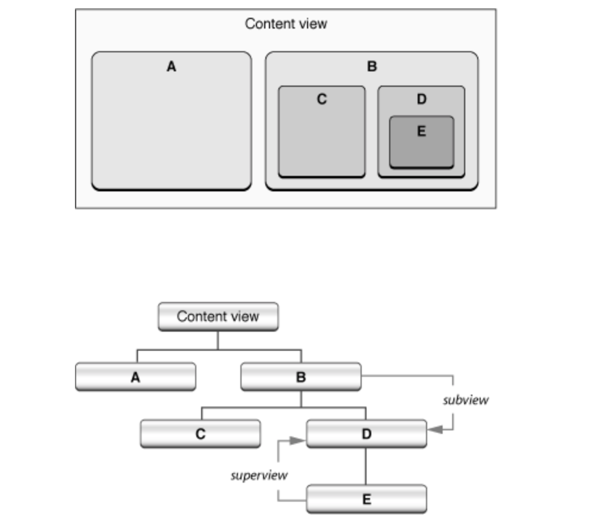

# Design patterns in Cocoa touch

## Cocoa Touch란?

Cocoa Touch란...

## Cocoa Touch에서 사용되는 디자인 패턴들

### Composite Pattern

Composite 패턴은 관련 오브젝트들을 하나의 트리 구조로 구성하여 부분-전체 계층을 표현하는 패턴으로, 이 패턴은 클라이언트가 단일 객체와 복합 객체를 모두 동일한 방법으로 다루도록 한다.

### 근거

Composite 패턴은 Cocoa touch에서 View Hierarchy를 구성하는데 사용되고 있다. 먼저 아래 그림을 보자.

Window 위의 `View`들은 내부적으로 또 다른 View hierarchy로 구조화된다. hierarchy의 루트는 Window와 Content view가 있다. Content View에 추가된 View들은 Content View들의 subview가 되고, 새로 추가된 view들의 Superview가 된다. Content view를 제외하고 View에는 하나의 superview와 여러 개의 subview가 존재한다. 위의 그림은 이러한 내용을 보여주고 있다.

view hierarchy는 드로잉과 이벤트 핸들링을 처리하는 구조적인 아키텍쳐이다. view에는 그래픽 작업이 수행되는데 영향을 주는 `Frame`과 view의 `Bounds`라는 두 개의 bounding rectangle이 있다. Frame은 외부 경계인데, 뷰를 super view 좌표 시스템에서 view를 찾아 크기를 정의하고, 뷰의 가장자리를 그리는 클립을 만든다. Bounds는 해당 View가 그려지는 표면의 내부 좌표 시스템을 정의한다. 

Window가 디스플레이를 위한 준비를 위해 windowing system을 요청받을 때, 수퍼 뷰는 서브 뷰 이전에 렌더링을 요청받게 된다. 일부 메시지를 view로 보내면 (예를 들어 view에서 view를 다시 그리도록 요청하는 메시지) 메시지는 subview로 전파된다. 따라서 뷰 계층 구조의 한 부분을 통합 뷰로 처리할 수 있다.

view hierarchy는 또한 이벤트 및 액션 메시지를 처리하기 위해 responder chain에서 사용된다.

그래서 프로그래머는 프로그래밍 또는 인터페이스 빌더를 이용해 view hierarchy에 언제든 view를 추가할 수 있다.

### Iterator Pattern

Iterator Pattern은 collection같은 aggregate object의 elements들에 순차적으로 접근하는 방법을 제공한다. Iterator Pattern은 iterator object에 collection으로부터 collection의 element들에 접근하는 책임을 전달한다. Iterator는 collection eletment로의 접근에 대한 인터페이스를 정의하고 현재 element의 내용을 가진다. iterator마다 traversal 정책은 다를 수 있다.

### 근거

Foundation 프레임워크의 Enumerator class가 Iterator pattern으로 구현되었다. Enumerator class의 concrete subclass는 enumerator object를 리턴하는데, 이는 array, set, dictionary와 같은 다양한 collection 타입의 순차적인 traversal을 가능하게 한다.

### Decorator Pattern

Decorator Pattern은 오브젝트에 추가적인 책임을 동적으로 할당한다. 다시 말해, decorator는 유연하게 subclassing(기능 확장)을 위한 대안을 제공한다. subclassing을 함으로서, Decorator pattern의 어댑터는 현재 존재하는 코드의 수정 없이 새로운 기능을 추가할 수 있게 한다. Decorator들은 객체를 감싸 객체의 행동을 확장한다. 또한 Decorator는 래핑 된 객체와 동일한 인터페이스를 구현하고 래핑 된 객체에 작업을 위임하기 전이나 후에 고유한 행동을 추가한다. Decorator Pattern은 OCP(Open Close Principle)를 표현한다.

### 근거

NSAttributedString, CollectionView, TableView, UIDatePicker등에서 사용되었다. 

### Chain of Responsibility

Chain of Responsibility Pattern은 두 개 이상의 개체에 요청을 처리할 수 있도록 하여 요청을 보내는 sender로부터 요청을 받는 receiver와의 결합을 없앤다. 이 패턴은 receiving 객체를 연결하여 체인을 만든다. 그리고 이 체인을 통해서 요청을 받을 객체에 메시지를 전달할 수 있다. 체인의 각 오브젝트들은 request를 받아 처리하거나 chain의 다음 오브젝트로 request를 전달한다.

### 근거

UIKit에서는 responder chain을 이와 같은 방법으로 구현하고 있다. (AppKit(OS X)에서의 구현과는 다소 차이가 있다고 한다.) 유저에 의해 Event가 발생하면, UI Application Object는 다음 responder인 UIWindwow에게 전달하고, 같은 방식으로 반복하여 **first responder object**를 찾는다. 만약 first responder object가 해당 이벤트를 처리하지 못하면, 다시 Responder Chain을 타고 UIApplication Object로 event를 전달하여 여기서 이벤트를 drop한다.
